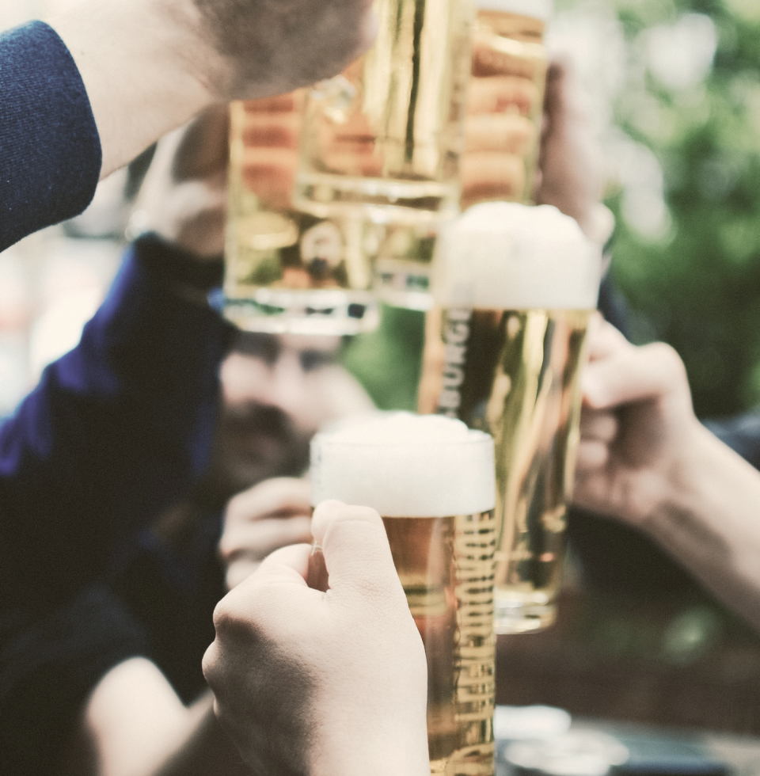

<!DOCTYPE html>
<html lang="en">

<head>
    <meta charset="UTF-8">
    <meta http-equiv="X-UA-Compatible" content="IE=edge">
    <meta name="viewport" content="width=device-width, initial-scale=1.0">
    <link rel="stylesheet" href="styles/global.css">
    <link rel="stylesheet" href="styles/home.css">

    <title>Callejeando- Home</title>
</head>

<body>
    <nav>
        <ul>
            <li><a href="index.html">Inicio</a></li>
            <li><a href="restaurantes.html">Restaurantes</a></li>
            <li><a href="alterno.html">Alterno</a></li>
            <li><a href="tour.html">Tour</a></li>
            <li id="alcaldia"><a href="#">Alcaldía</a>
                <ul class="submenu">
                    <li><a href="alcaldia.html">Medellín</a></li>
                    <li><a href="#">Bello</a></li>
                    <li><a href="#">Envigado</a></li>
                    <li><a href="#">Itagüi</a></li>
                    <li><a href="#">La Estrella</a></li>
                    <li><a href="#">Sabaneta</a></li>
                </ul>
            </li>
        </ul>
        

            <a href="#">Esp</a>
            <a href="#">Eng</a>
        

    </nav>
    

    <main>
        <section class="hero">
            

                

                    <h1>Callejeando</h1>
                    
en Valle de Aburra

                

                

                    <ul>
                        <li>
                            
Encuentra los mejores planes de la ciudad

                        </li>
                        <li>
                            
¿Restricciones COVID? Enterate

                        </li>
                        <li>
                            
Descubre sitios que no conocías

                        </li>
                        <li>
                            
Planes gratuitos para que disfrutes sin gastar

                        </li>
                    </ul>
                

            

            

                <picture>
                    <source media="(max-width: 1024px)" srcset="assets/home/home-hero-mov.jpg">
                    
                </picture>
            

        </section>
        <section class="content">
            

                <h2>¿Sin parche?</h2>
                
Aquí encuentras toda la información para armarlo

            

            

                

                    
Hemos reunido en un solo lugar, todo lo que necesitas para planear la salida de esta noche o del
                        fin de semana. ¿No sabes a dónde llevar a tu pareja a comer?, ¿Qué tal un picnic para celebrar
                        unos cumpleaños?, ¿O tienes ganas de puebliar este fin de semana? Aquí lo encuentras todo.

                

                

                    

                        <ul>
                            <li>
                                
<strong>Restaurantes: </strong>Puedes filtrar tu búsqueda por tipo (romantico o
                                    familiar) por cocina (mediterranea, italiana, americana, colombiana...) y por
                                    precios por persona.

                            </li>
                            <li>
                                
<strong>Alterno: </strong>Encuentra bares, conoce parques o entérate de planes
                                    alternativos como conciertos, museos u obras de teatro.

                            </li>
                            <li>
                                
<strong>Tour: </strong>Una lista con los sitios más emblematicos de la ciudad y otros
                                    no tan conocidos. Y si quieres puebliar, te damos toda la información que necesitas
                                    patra viajar (distancias, tiempos de viaje, costos de peajes, lugares que visitar en
                                    tu destino).

                            </li>
                            <li>
                                
<strong>Alcaldía: </strong>Hay muchos eventos organizados por la Secretaría de
                                    Cultura que te pueden interesar, algunos incluso son gratuitos.

                            </li>
                        </ul>
                    

                    

                        
                    

                

            

        </section>
        <section class="content">
            

                <h2>Eventos</h2>
                
Planea tu salida

            

            

                

                    
Preparamos una agenda semanal con todos los eventos que hay en la ciudad, filtra por categoría,
                        selecciona un día y encuentra tu mejor plan. Elige el evento que te interesa y consigue más
                        información. ¿Qué quieres hacer hoy?

                

                

                    

                        <select name="category" id="category">
                            <option value="Restaurante">Restaurante</option>
                            <option value="Bares">Bares</option>
                            <option value="Teatro">Teatro</option>
                        </select>
                        Categoría</label>
                    

                    

                        

                            Diciembre 2021
                            

                                

                                    
Lun

                                    23
                                    
                                    
0 eventos

                                

                                

                                    
Mar

                                    24
                                    
                                    
0 eventos

                                

                                

                                    
Mie

                                    25
                                    
                                    
0 eventos

                                

                                

                                    
Jue

                                    26
                                    
                                    
0 eventos

                                

                                

                                    
Vie

                                    27
                                    
                                    
0 eventos

                                

                                

                                    
Sab

                                    28
                                    
                                    
0 eventos

                                

                                

                                    
Dom

                                    29
                                    
                                    
0 eventos

                                

                            

                        

                        

                            <ul>
                                <li class="singleEvent" id="1">Ballet "El Cascanueces" en Teatro Cristales</li>
                                <li class="singleEvent" id="2">HipHop al Parque en Parque Ditaires</li>
                                <li class="singleEvent" id="3">Tributo a Soda Stereo en Rock 90's Bar</li>
                                <li class="singleEvent" id="4">Ciclovía Nocturna</li>
                                <li class="singleEvent" id="5">Lorem Ipsum</li>
                                <li class="singleEvent" id="6">Lorem Ipsum</li>
                                <li class="singleEvent" id="7">1er Concurso Skateboard Freestyle Envigado</li>
                            </ul>
                        

                    

                    

                        &#60;
                        1
                        2
                        &#62;
                    

                

            

        </section>
        <section class="content">
            

                <h2>Únete a CALLEJEANDO</h2>
                
Aparece en nuestra agenda y logra más asistencia a tus eventos

            

            

                

                    
Llega a más personas uniendote a Callejeando.

                    
Las redes sociales agrupan al público basados en sus preferencias, sesgando tu audiencia y
                        limitando la cantidad de personas a las que puedes llegar, en el mismo sentido el trafico en tu
                        página web depende de las interacciones con tus redes sociales o la búsqueda orgánica en motores
                        de búsqueda como Google, limitando tu público potencial.

                    
Aquí nos reunimos todo el mundo, personas de diferentes gustos, con diferentes intereses y todas
                        podrán ver tu marca y enterarse de tus eventos.

                    
Registrate a continuación y con gusto te envíamos los planes que tenemos para tí, o también
                        puedes escribirnos por Whatsapp

                

                <form action="" name="contactForm">
                    

                        Nombre Completo*
                        <input type="text" name="name" id="name" placeholder="Ingresa tu nombre">
                        

                    

                    

                        Correo Electrónico*
                        <input type="email" name="email" id="email" placeholder="Ingresa tu correo electrónico">
                        

                    

                    <button form="contactForm" onclick="return validateForm()">Enviar</button>
                </form>
            

        </section>
        <section class="content">
            

                <h2>Nuestros Aliados</h2>
                
Ellos nos invitan a callejear

            

            

                

                    

                        

                            
                        

                        

                            
                        

                        

                            
                        

                        

                            
                        

                        

                            
                        

                        

                            
                        

                        

                            
                        

                        

                            
                        

                        

                            
                        

                    

                

            

        </section>
        

            

                
            

            

                

                    

                        

                            
                            
                            
                        

                    

                    

                        
                        
                        
                        
                        
                    

                

                

                    

                        <h2>Tributo a Soda Stereo</h2>
                        
En Rock 90's Bar

                        
Lorem ipsum dolor sit, amet consectetur adipisicing elit. Illo sed quae eius cupiditate
                            reprehenderit quidem rerum repellendus a ipsam delectus amet eum eos, aperiam libero
                            provident magni. Harum, animi praesentium.

                    

                    

                        

                            
                            
Viernes 27 de Diciembre

                        

                        

                            
                            
Calle XX # XX-XX, Medellín

                        

                    

                

            

        

        

            

                
            

            

                <h2>Gracias</h2>
                Por contactarnos
                
Al correo electrónico que registraste, te llegarán las propuestas que te ofrecemos para ser parte
                    de <strong>Callejeando</strong>

            

        

    </main>
    <footer>
        
Callejeando

        
Todos los eventos de tu ciudad, 2021

    </footer>
    
    
</body>

</html>